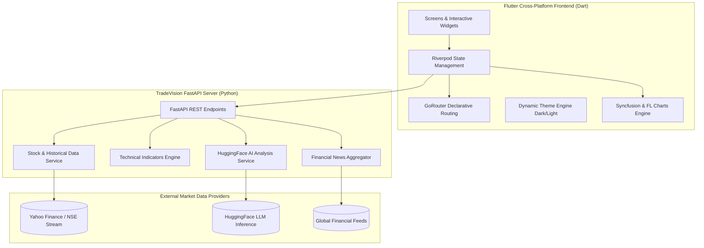

<div align="center">

# ⚡ TradeVision AI

### *Next-Gen AI-Powered Stock Analysis & Interactive Trading Platform*

[](https://flutter.dev)
[](https://dart.dev)
[](https://fastapi.tiangolo.com)
[](https://www.python.org)
[](https://github.com/CodeWidKrish/TradeVision-AI)
[](LICENSE)

<br />

> **TradeVision AI** simplifies complex market volatility into actionable, institutional-grade intelligence for retail traders and investors across the **NSE (National Stock Exchange)** and **BSE (Bombay Stock Exchange)**.

</div>

---

## 🌟 Key Highlights & Innovations

### 🤖 AI-Powered Market Intelligence
* **Autonomous Trend & Sentiment Analysis:** Natural language insights powered by machine learning and LLM synthesis.
* **Smart Signals:** Real-time BUY / HOLD / SELL recommendations with institutional confidence metrics and risk factors.
* **AI Explanation Sheets:** Tap any signal to inspect moving averages, RSI divergence, MACD crossovers, and volume spikes.

### 📈 Institutional-Grade Interactive Charts
* **Dual Rendering Modes:** Toggle between smooth **Area Line** charts and **Japanese Candlestick** charts.
* **Precision Technical Overlays:** 
  * `MA(20)` — 20-period simple moving average
  * `EMA(50)` — 50-period exponential trend indicator
  * `Bollinger Bands` — 20-period volatility envelopes
  * `Volume Histograms` — Color-coded buy/sell volume bars
* **Price Anchoring via Brownian Bridge:** Intraday trajectories start at the opening bell and mathematically converge precisely at the live market price without drift.
* **Multi-Timeframe Analysis:** Instant 1D, 1W, 1M, 3M, 6M, 1Y, and MAX views with zero-latency caching.

### 🔄 3D Perspective Card Flip Architecture
* **Portfolio & Movers 3D Cards:** Real-time 3D rotation (`Matrix4.identity()..setEntry(3, 2, 0.0014)..scale()..rotateY()`) featuring dynamic mid-air elevation and realistic surface shading.
* **Gesture & Tab Driven:** Swipe left/right or tap tabs to flip between Top Gainers and Top Losers with haptic feedback.

### 🏢 Authentic Corporate Vector Identities
* **Zero-Latency Inlined SVGs:** High-fidelity, present-day corporate vector marks for Indian market leaders:
  * **TCS:** Official TATA brandmark with cyan accent.
  * **INFY:** Official lowercase `infosys` brand lettering.
  * **WIPRO:** Modern post-2017 multi-colored dynamic dots cluster.
  * **RELIANCE:** Royal navy medallion with golden torch flame.
  * **HDFC BANK:** Geometric red interlocking corner blocks with white grid gutters.
  * **SBI:** Signature cyan circular keyhole vault emblem.
  * **ICICI BANK:** Deep maroon badge with the iconic orange-gold flame "i".
  * **BAJFINANCE:** Royal blue tile with official white/cyan dual flight wings.
  * **ZOMATO:** Vibrant crimson badge with iconic bold italic `zomato` lettering.
  * **TATA MOTORS:** Dual arched chrome ellipses emblem.
  * **MARUTI SUZUKI:** Geometric red Suzuki "S" brandmark.

### ⏱️ Live IST Market Engine & Status
* **Real-time Indian Standard Time (IST) Clock:** Displays trading session phases (Pre-Open, Normal Market Hours `09:15 – 15:30 IST`, and Closed).
* **Live Ticker Tape:** Real-time flashing stock prices with green/red pulse animations on tick updates.

### 📱 Modern Edge-to-Edge Navigation
* **Instagram-Grade Bottom Bar:** 64px floating translucent navigation bar with top active pill indicators and system bar transparency on Android & iOS.
* **Theme Engine:** Fully tailored OLED Dark Mode (`#0A0E1A` / `#111827`) and high-contrast Light Mode (`#FFFFFF` / `#F8FAFC`).

---

## 🏛️ System Architecture



---

## 📂 Project Structure

```text
TradeVision-AI/
├── backend/                        # FastAPI Backend Services
│   ├── app/
│   │   ├── routers/                # API route controllers (stocks, chart, indicators, ai)
│   │   ├── schemas/                # Pydantic request/response validation schemas
│   │   ├── services/               # Business logic (yfinance streaming, AI synthesis)
│   │   └── main.py                 # FastAPI application entrypoint
│   └── requirements.txt            # Python dependencies
│
├── frontend/                       # Flutter Mobile & Web Client
│   ├── android/                    # Native Android wrapper (WindowInsetsCompat, Edge-to-Edge)
│   ├── assets/                     # Corporate logos, vector SVGs, and brand images
│   ├── lib/
│   │   ├── core/
│   │   │   ├── data/               # Static stock repositories & benchmark tickers
│   │   │   ├── providers/          # Riverpod state providers (market, portfolio, theme)
│   │   │   └── theme/              # Color tokens, typography, and dark OLED surfaces
│   │   ├── router/                 # GoRouter route configurations
│   │   ├── screens/                # UI Screens (Home, Market, Chart, Watchlist, Profile)
│   │   ├── services/               # Local persistence & REST client
│   │   ├── widgets/                # Reusable UI widgets (3D FlipCard, RealStockChart, Logos)
│   │   └── main.dart               # Flutter app entrypoint
│   ├── pubspec.yaml                # Flutter packages and asset manifest
│   └── test/                       # Automated widget and unit tests
│
├── .gitignore                      # Git exclusion rules (builds, caches, venv)
└── README.md                       # Repository documentation
```

---

## 🚀 Quick Start Guide

### Prerequisites
* **Flutter SDK:** `>= 3.19.0` ([Install Flutter](https://docs.flutter.dev/get-started/install))
* **Python:** `>= 3.10` ([Download Python](https://www.python.org/downloads/))
* **Android Studio / Xcode** (for mobile simulation or physical device debugging)

---

### 1. Backend Setup (FastAPI)

```bash
# Navigate to the backend directory
cd backend

# Create a virtual environment
python -m venv venv

# Activate the virtual environment
# On Windows:
.\venv\Scripts\activate
# On macOS / Linux:
source venv/bin/activate

# Install dependencies
pip install -r requirements.txt

# Start the development server
uvicorn app.main:app --reload --host 0.0.0.0 --port 8000
```
> The API will be live at `http://localhost:8000` with interactive Swagger docs at `http://localhost:8000/docs`.

---

### 2. Frontend Setup (Flutter)

```bash
# Navigate to the frontend directory
cd frontend

# Fetch all Flutter dependencies
flutter pub get

# Run the automated test suite
flutter test test/widget_test.dart

# Launch on connected mobile device or browser
flutter run
```

---

### 3. Building Release APK

To compile an optimized, tree-shaken Android production release APK:

```bash
cd frontend
flutter build apk --release
```
The output file will be generated at:
`frontend/build/app/outputs/flutter-apk/app-release.apk`

---

## 📡 Core API Reference

| Method | Endpoint | Description |
| :--- | :--- | :--- |
| `GET` | `/api/v1/stocks` | Returns real-time quotes for NIFTY 50 and tracked market leaders |
| `GET` | `/api/v1/stocks/{ticker}` | Returns comprehensive stock overview, market cap, and fundamentals |
| `GET` | `/api/v1/chart/{ticker}` | Returns OHLC candlestick data across timeframes (`1D`, `1W`, `1M`, `1Y`) |
| `GET` | `/api/v1/indicators/{ticker}` | Computes MA(20), EMA(50), Bollinger Bands, RSI, and MACD |
| `POST`| `/api/v1/ai/generate` | Synthesizes technical data into natural-language trade insights |
| `GET` | `/api/v1/news` | Returns curated, real-time financial market news |

---

## 🧪 Testing & Validation

The codebase includes automated unit and widget tests covering core business logic:

```bash
flutter test
```

```text
00:00 +0: AiConfidenceGauge renders score and label correctly
00:01 +1: TickerFlashPrice renders price correctly
00:01 +2: Every stock in repository produces valid OHLC points for each timeframe
00:01 +3: ChartHeaderRow renders periods and toggles between line and candlestick
00:01 +4: TickerLogo renders successfully for all stocks
00:02 +5: SwipeToExecuteButton renders and triggers onConfirmed
00:02 +6: AppBottomNav renders all tabs and triggers onTabSelected
00:02 +7: All tests passed!
```

---

## 👤 Author

**Krish Hingu**
* GitHub: [@CodeWidKrish](https://github.com/CodeWidKrish)
* Project: [TradeVision-AI](https://github.com/CodeWidKrish/TradeVision-AI)

---

## 📄 License

This project is licensed under the MIT License — see the [LICENSE](LICENSE) file for details.

<div align="center">
  <sub>Built with ❤️ for intelligent investing on Indian Capital Markets.</sub>
</div>
